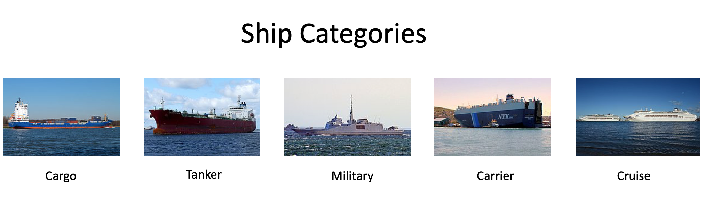

# Analytics Vidhya - Game of Deep Learning || Computer Vision Hackathon
 - Competition Link: https://datahack.analyticsvidhya.com/contest/game-of-deep-learning/
 
## Kaggle Public Kernel
Checkout my kaggle kernel :https://www.kaggle.com/niranjankumarc/game-of-deep-learning-computer-vision-hackathon

--------------------------------------------------------------------------------
# Problem Statement
Ship or vessel detection has a wide range of applications, in the areas of maritime safety, fisheries management, marine pollution, defence and maritime security, protection from piracy, illegal migration, etc.

Keeping this in mind, a Governmental Maritime and Coastguard Agency is planning to deploy a computer vision based automated system to identify ship type only from the images taken by the survey boats. You have been hired as a consultant to build an efficient model for this project.

There are 5 classes of ships to be detected which are as follows:

* Cargo
* Military
* Carrier
* Cruise
* Tankers


There are 5 classes of ships to be detected which are as follows: 



## Dataset Description

There are 6252 images in train and 2680 images in test data. The categories of ships and their corresponding codes in the dataset are as follows -
```
'Cargo' -> 1
'Military' -> 2
'Carrier' -> 3
'Cruise' -> 4
'Tankers' -> 5
```
- There are three files provided to you, viz train.zip, test.csv and sample_submission.csv which have the following structure.

| Variable	| Definition |
| ------------- | ----------------- |
| image	| Name of the image in the dataset (ID column) |
| category | Ship category code (target column) |
 

- train.zip contains the images corresponding to both train and test set along with the true labels for train set images in train.csv

## Evaluation Metric
The Evaluation metric for this competition is weighted F1 Score.

## Public and Private Split
Public leaderboard is based on randomly selected 30% of the test images, while private leaderboard will be evaluated on remaining 
70% of the test images.

## Approach
 - Created a Custom Pytorch Data loader function
 - Used Pytorch Pretrained Models
 - Used Resnet50, Resnet152 and Resnet101
 - Final Submission is result of votings based on 3 submission files created from 3 different models:
     - Image size 224x224
     - Data Augmenation
     - Stratified Sampling split for training and validation data because of data imbalance
     - Pre-trained network(resnet50, Resnet152 and Resnet101) - Unfreezed All Layers
     - Saved the best model with good accuracy and used that to make predictions

## Dependencies
* [Python 3.5+](https://www.continuum.io/downloads)
* [PyTorch 0.4.0+](http://pytorch.org/)

## Score
- private LB Score - 0.504 (Rank - 386/2083)

## To-DO
- Using Keras for knowledge
- Using Fastai for knowledge

## Author
NiranjanKumar [@niranjankumar-c](https://github.com/Niranjankumar-c)
